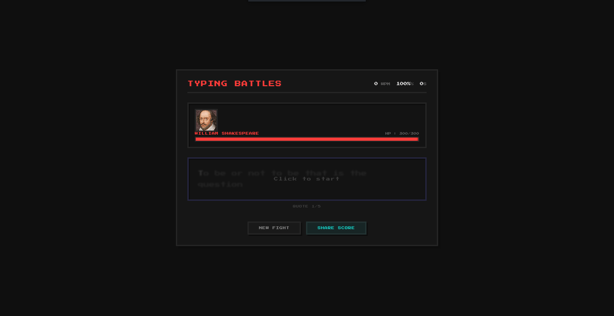
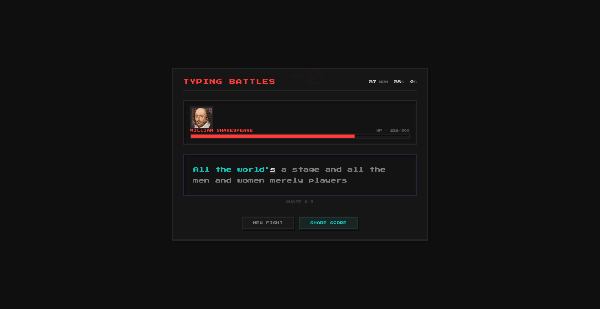
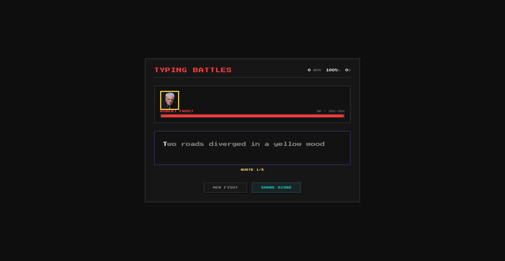
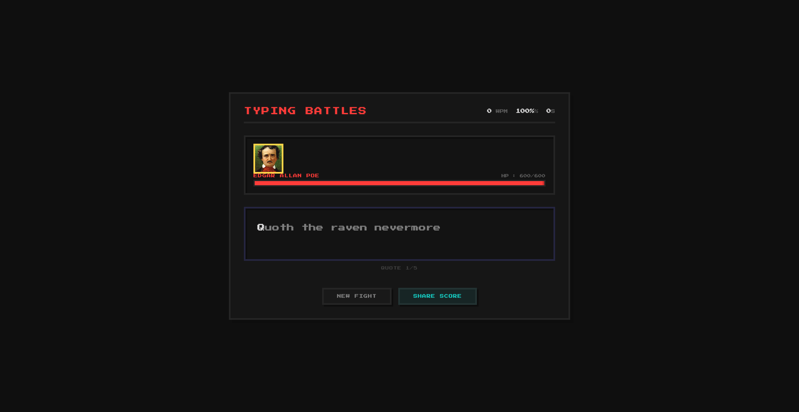

# Typing Battles 

A game inspired by the web game Monkey Type, where you use your typing speed in order to defeat famous writers throughout history in epic boss battles!

# Features 
- Real time typing speed (WPM) and accuracy tracking
- Share your scores with friends after defeating a boss
- Fight 3 unique literary bosses: William Shakespeare, Robert Frost, and Edgar Allan Poe
- Combo system - Type accurately in succession to build combos and deal extra damage
- Boss special attacks - Each boss has unique abilities that trigger when their health gets low
- Dynamic diifficulty - The faster and more accurately you type, the more damage you deal
- Pixel art aesthetic - Clean, retro gaming feel
- Boss portraits - Each boss has their own unique image 

# Screenshots 

# Controls 
- Click to focus typing area
- Type the displayed text

# How to play 
1. Click on the blurred text to begin
2. Each boss has multiple quotes you need to type through 
3. Correct letters that you type deal damage to the boss
4. Type correctly many times in a row to build your combo meter, every 10 combo gives you bonus damage
5. After beating the first boss you can move to the 2nd and finally the 3rd to beat the game 

# Tech Stack 
- Static HTML
- Javascript 
- CSS

# Future Improvments 
In the future I would probably add new bosses, and also re-add the practice mode. I would also aim to make themes like monkeytype, as a major thing in monkeytype is its hundreds of themes so that users can choose whichever one they like.
# Made by Funnybunny123 
# Fun fact, Saatvik's (Healio's) old username in Minecraft was Funnybunny123